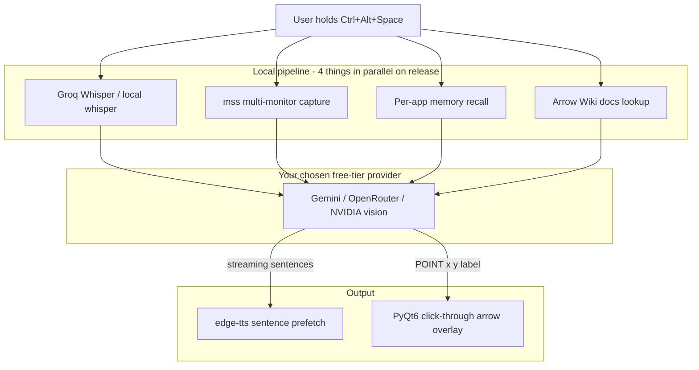

<h1 align="center">Arrow Assistant</h1>

<p align="center">
  A voice-driven, screen-aware AI buddy for Windows. Hold a hotkey, ask anything about whatever app you are looking at, and Arrow talks back and points an arrow at the exact button to click. It points, you click.
</p>

<p align="center">
  
  
</p>

Built as my own version of [Clicky Windows](https://github.com/AbhishekVulla/clicky-windows) (itself a Windows port of [Farza's Clicky](https://github.com/farzaa/clicky)) - same idea, rebuilt from scratch so the whole stack runs on **free tiers**. No paid APIs required.

## What it does

You are working in some app. You hit a wall. You hold `Ctrl+Alt+Space`, ask a question out loud, release. A couple of seconds later you hear the answer, and an arrow lands on the exact button or menu item you need.

In teach mode (the default), Arrow never touches your mouse or keyboard. It shows you where to go, you do the clicking, and you come out of it actually knowing the app. (The separate, opt-in [agent mode](docs/AGENT.md) can click and type for you, with approvals and a panic key.)

Extras on top of the basic loop:

- **Per-app memory.** Arrow remembers your recent questions in each app (SQLite + a readable markdown tail in `Documents/Arrow Memory`), so follow-ups like "and then?" work.
- **Knowledge folder.** Drop a markdown file with docs into `Documents/Arrow Wiki/<app>.exe.md` and Arrow becomes an expert in obscure or company-internal software the AI has never heard of.

## Why this version exists (free-tier stack)

The original Clicky Windows runs on paid APIs (Anthropic + AssemblyAI + Cartesia, about $0.016 per 30-second interaction). Arrow Assistant swaps each layer for a free alternative:

| Layer | Clicky Windows | Arrow Assistant |
| --- | --- | --- |
| Brain (vision LLM) | Claude Sonnet (paid) | **Gemini free tier** (AI Studio key), or OpenRouter free models, or NVIDIA Build free |
| Speech-to-text | AssemblyAI (paid) | **Groq Whisper free tier**, or local faster-whisper (no key, offline) |
| Text-to-speech | Cartesia / ElevenLabs (paid) | **edge-tts** (free neural voices, no key), or pyttsx3 offline |
| Keys storage | keyring | same (Windows Credential Manager) |

Local speech (local whisper + pyttsx3) needs **zero speech API keys** and is slower. Install the optional speech dependencies below first. The vision/LLM still needs a cloud provider key.

## Agent mode (new)

Arrow can also *do* short tasks for you, with approval and a panic key. See [docs/AGENT.md](docs/AGENT.md).

## Setup

1. Install **64-bit Python 3.12** on Windows (recommended). Do not use 32-bit Python for this setup. Python 3.15 is not supported: required native packages, including optional CTranslate2, do not all publish 3.15 wheels. Python 3.13/3.14 have default-install CI checks, but use 3.12 for this setup.
2. From the extracted project folder, create a clean environment:
   ```powershell
   py -3.12 -m venv .venv
   .\.venv\Scripts\python.exe -m pip install --upgrade pip
   .\.venv\Scripts\python.exe -m pip install -r requirements.txt
   ```
3. Copy `.env.example` to `.env` and add what you have:
   - `GEMINI_API_KEY` - free key from [Google AI Studio](https://aistudio.google.com/apikey) (recommended), **or** `OPENROUTER_API_KEY`, **or** `NVIDIA_API_KEY`
   - `GROQ_API_KEY` - free key from [Groq](https://console.groq.com/keys) for the default lightweight install; without it you need the optional local speech install below
   - TTS needs no key.
4. `.\.venv\Scripts\python.exe -m arrow_assistant`
5. Hold `Ctrl+Alt+Space`, ask something, release.

Everything runs through your own keys. Nothing routes through a proxy server.

### Optional local speech

The normal install does **not** include faster-whisper/CTranslate2 or pyttsx3.
For local speech, in the same environment:

```powershell
.\.venv\Scripts\python.exe -m pip install -r requirements-local.txt
```

This option downloads a model on first use and takes extra disk space and RAM.
Use Groq speech on a low-memory PC. If pip reports no matching CTranslate2
build, check your Python version, architecture, and package index rather than
forcing incompatible versions. A missing local speech package gives an
installation hint instead of an unexplained import error.

For an existing failed install, you can use the default cloud speech path by
removing the `faster-whisper` and `pyttsx3` lines from the old requirements file,
then running `python -m pip install --upgrade pip` and
`python -m pip install -r requirements.txt`. This does not fix unsupported
Python/architecture combinations for the remaining native packages.

## How it works



On hotkey release, four things kick off in parallel: speech-to-text, screen capture, memory recall, and KB lookup. The vision model receives the screenshot plus transcript plus memory plus docs, and streams the answer. Sentences flush to TTS the moment a `.!?` boundary lands, so you start hearing the answer while the rest is still generating. A `[POINT:x,y:label]` tag in the reply drives the overlay arrow.

Notable details (credit to Clicky Windows for pioneering these):

- **Observe-only hotkey.** `pynput.Listener(suppress=False)` watches keys without eating them, so your typing never breaks.
- **Click-through overlay.** One transparent QWidget per physical monitor (mixed-DPI safe), made click-through with Win32 layered-window flags applied after `show()`.
- **Prefetch double-buffer.** The next sentence's audio is synthesized while the current one is still playing, so gaps stay near zero.

## Pointing troubleshooting

The overlay is shown only when the model locates a visible target and emits
`[POINT:x,y:label]`. It clears after six seconds; voice-only answers may have
no target. Ask for a specific visible menu or word and watch during the reply.
The app captures the monitor containing your mouse pointer.

Teach-mode metadata in `Documents/Arrow Memory/arrow.log` now records
`teach points: parsed=... invalid=... incomplete=...` plus image size,
monitor origin, and scale. It does not record model text, screenshots, or keys.
`parsed=0 invalid=0 incomplete=0` means no usable point tag was found;
nonzero invalid/incomplete counts mean the model's tags were malformed or cut
short. A positive parsed count means points were sent to the overlay, not
proof they were visibly drawn. Check terminal errors and monitor/scaling if
points were parsed but nothing appeared. Prompt changes do not guarantee
that every model will locate every target correctly.

## Development

```bash
pip install -r requirements-dev.txt
pytest -q
```

The test suite covers the sentence streamer, point-tag parsing, per-monitor point routing, memory, KB, provider selection, the hotkey state machine, the STT/TTS pipeline (mocked), and the agent loop with its safety gates (all with fakes: no network, screen, or mouse). CI runs them on every push.

## Privacy

- Screenshots and audio go only to the provider whose key you configured.
- Memory and wiki files stay on your machine (`Documents/Arrow Memory`, `Documents/Arrow Wiki`).
- No analytics, no proxy, no account.

## License

MIT. Inspired by [Clicky Windows](https://github.com/AbhishekVulla/clicky-windows) - implementation here is original.
