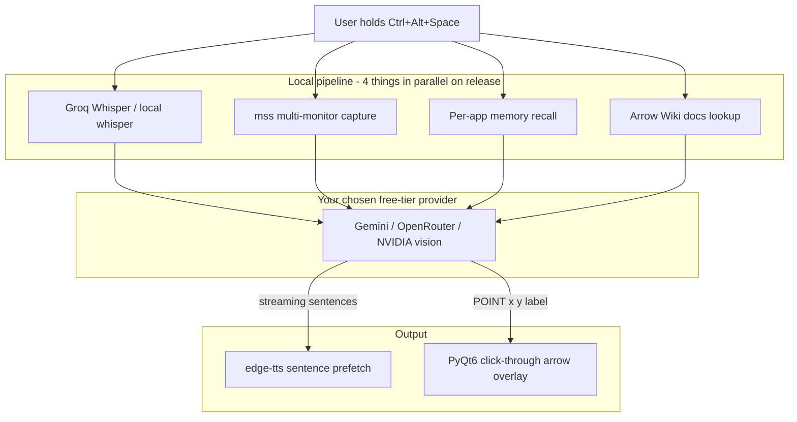

<h1 align="center">Arrow Assistant</h1>

<p align="center">
  A voice-driven, screen-aware AI buddy for Windows. Hold a hotkey, ask anything about whatever app you are looking at, and Arrow talks back and points an arrow at the exact button to click. It points, you click.
</p>

<p align="center">
  
  
</p>

Built as my own version of [Clicky Windows](https://github.com/AbhishekVulla/clicky-windows) (itself a Windows port of [Farza's Clicky](https://github.com/farzaa/clicky)) - same idea, rebuilt from scratch so the whole stack runs on **free tiers**. No paid APIs required.

## What it does

You are working in some app. You hit a wall. You hold `Ctrl+Alt+Space`, ask a question out loud, release. A couple of seconds later you hear the answer, and an arrow lands on the exact button or menu item you need.

Arrow never touches your mouse or keyboard. It shows you where to go, you do the clicking, and you come out of it actually knowing the app.

Extras on top of the basic loop:

- **Per-app memory.** Arrow remembers your recent questions in each app (SQLite + a readable markdown tail in `Documents/Arrow Memory`), so follow-ups like "and then?" work.
- **Knowledge folder.** Drop a markdown file with docs into `Documents/Arrow Wiki/<app>.exe.md` and Arrow becomes an expert in obscure or company-internal software the AI has never heard of.

## Why this version exists (free-tier stack)

The original Clicky Windows runs on paid APIs (Anthropic + AssemblyAI + Cartesia, about $0.016 per 30-second interaction). Arrow Assistant swaps each layer for a free alternative:

| Layer | Clicky Windows | Arrow Assistant |
| --- | --- | --- |
| Brain (vision LLM) | Claude Sonnet (paid) | **Gemini free tier** (AI Studio key), or OpenRouter free models, or NVIDIA Build free |
| Speech-to-text | AssemblyAI (paid) | **Groq Whisper free tier**, or local faster-whisper (no key, offline) |
| Text-to-speech | Cartesia / ElevenLabs (paid) | **edge-tts** (free neural voices, no key), or pyttsx3 offline |
| Keys storage | keyring | same (Windows Credential Manager) |

Fully offline mode (local whisper + pyttsx3) works with **zero API keys**, it is just slower.

## Setup

1. Install Python 3.11+ on Windows.
2. `pip install -r requirements.txt`
3. Copy `.env.example` to `.env` and add what you have:
   - `GEMINI_API_KEY` - free key from [Google AI Studio](https://aistudio.google.com/apikey) (recommended), **or** `OPENROUTER_API_KEY`, **or** `NVIDIA_API_KEY`
   - `GROQ_API_KEY` - free key from [Groq](https://console.groq.com/keys); leave empty to use local whisper instead
   - TTS needs no key.
4. `python -m arrow_assistant`
5. Hold `Ctrl+Alt+Space`, ask something, release.

Everything runs through your own keys. Nothing routes through a proxy server.

## How it works



On hotkey release, four things kick off in parallel: speech-to-text, screen capture, memory recall, and KB lookup. The vision model receives the screenshot plus transcript plus memory plus docs, and streams the answer. Sentences flush to TTS the moment a `.!?` boundary lands, so you start hearing the answer while the rest is still generating. A `[POINT:x,y:label]` tag in the reply drives the overlay arrow.

Notable details (credit to Clicky Windows for pioneering these):

- **Observe-only hotkey.** `pynput.Listener(suppress=False)` watches keys without eating them, so your typing never breaks.
- **Click-through overlay.** One transparent QWidget per physical monitor (mixed-DPI safe), made click-through with Win32 layered-window flags applied after `show()`.
- **Prefetch double-buffer.** The next sentence's audio is synthesized while the current one is still playing, so gaps stay near zero.

## Development

```bash
pip install -r requirements-dev.txt
pytest -q
```

58 tests cover the sentence streamer, point-tag parsing, per-monitor point routing, memory, KB, provider selection, the hotkey state machine, and the STT/TTS pipeline (mocked). CI runs them on every push.

## Privacy

- Screenshots and audio go only to the provider whose key you configured.
- Memory and wiki files stay on your machine (`Documents/Arrow Memory`, `Documents/Arrow Wiki`).
- No analytics, no proxy, no account.

## License

MIT. Inspired by [Clicky Windows](https://github.com/AbhishekVulla/clicky-windows) - implementation here is original.
